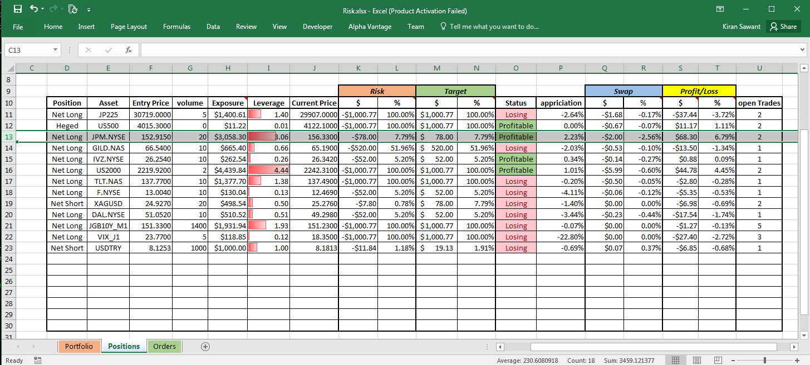
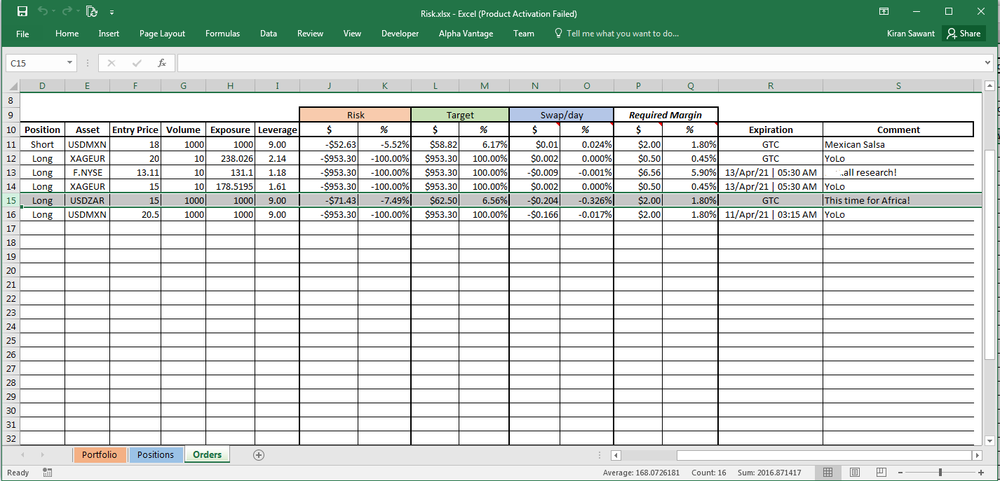
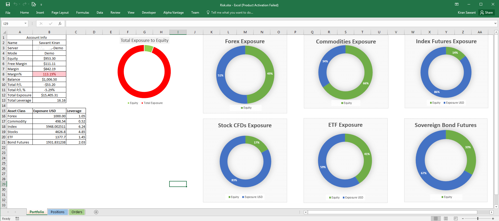

# Risk-Monitor

<i>Risk-monitor</i> helps monitor basic risk parameters while trading Global macro. 
 It helps in reactive risk management, while running a multinational portfolio of assets. 

## Motivation
In the retail trading world, nearly 90% of retail traders blow-up their accounts within 3 months. Most of them are naive but even for a well informed trader things can get chaotic as they explore various asset-classes, foreign assets and start building-up positions on these assets. 
The most important aspect of risk that many traders are unaware of, is the net market exposure on an asset, in their account currency, and therefore do not know their leverage either. <em>Not knowing your leverage on an asset is like not having a speedometer in a sports car;</em> you can drive it as fast as you want but will never know when you'll get in trouble and how much is too much. Things get even worse when you trade assets that are denominated in foreign currencies and you take multiple long/short trades on them. Things get messy and chaotic. 
Risk-Monitor helps mitigate this problem by calculating the net market exposure of an asset on which you have taken a position in a single currency i.e. US Dollar. And therefore the total leverage on that asset. It also calculates several other measures that are important.

## Requirements
- <a href="https://www.metatrader5.com/en/releasenotes/terminal/821">MetaTrader5 Terminal</a>
- <a href="https://www.mql5.com/en/docs/integration/python_metatrader5">MetaTrader5 Python module</a>
- <a href="https://www.xlwings.org/">xlwings python module</a>

## Preview
The app uses MS Excel as a frontend to display tables for <b>open positions</b>, <b>Pending Orders</b> and <b>Asset class exposure</b> each on their separate sheets and updates their status every 10 seconds. Just launch main.py and it shall open terminal and execl file automatically. 

Below is a snap of open positions and pending orders as shown in MT5.
 

I have open positions on various assets, in different asset classes like FX, index futures, stocks, ETFs, commodities and sovereign bond futures. Some of them are in  foreign denominations(assuming USD as account currency) and some have both long & short positions(vix_j1). I have a few pending orders as well.

The MT5 dashboard above does not show enough information about individual assets, infact, it looks cluttered and makes things more chaotic. risk monitor solves that problem.

## Positions
 

I have made a total of 24 trades as shown in MT5 snap. However, <em>Risk-Monitor</em> boils them down to 13, the number of assets I have position on. The Positions table shows the status of various risk-parameters of that asset, as explained below.

<table>
  <tr>
   <th>Position</th>
   <td>Your net position. If you buy 10x shares and then sell 30x shortly after, while simultaniously keeping both the trades open, your net position is short, and vice versa. You can take as many long and short trades on an asset and this column will display your net position. If you go long and short equal volume; displays <b>hedge</b>.
   </td>
  </tr>
  <tr>
     <th>Asset</th>
        <td>Symbol of the asset as in MT5 terminal
        </td>
  </tr>
  <tr>
     <th>Entry Price</th>
        <td>Net price at which you opened the trade in the assets original denomination. If you buy 10 shares @ $152.58 and then 10 more @ $153.25 your cumulative entry price will be $152.915/- i.e. taking those two positions @ those prices will yield the same returns as buying 20 shares @ $152.91, as shown on row 13 with JPM.NYSE(J.P. Morgan), I have two separate trades on this asset. One can take n number of long/short positions on an asset and it will show a single entry price for all of them.
        </td>
  </tr>
  <tr>
     <th>volume</th>
        <td>The cumulative volume on an asset. Units of base currency in FX. If you buy 10 and sell 5 @ the same time you are 5 long.
        </td>
  </tr>
  <tr>
     <th>Exposure</th>
        <td>Cumulative exposure on an asset in USD. If you buy 10 shares @ $10, your market exposure is $100/-. The Exposure column adjusts for long/short positions and foreign currencies as well. You can take as many long & short positions on any asset of any asset class denominated in any currency and it will show you the cumulative market exposure in USD. As you can see from above snippets, I have 5 long positions on JGB10Y_M1(japanese gov bond futures) that are denominated in JPY and i can see my exposure on it in USD($1931.34).
        </td>
  </tr>
  <tr>
     <th>Leverage</th>
        <td>The ratio of your market exposure on that asset against your account equity. It is the most important risk parameter in Risk-monitor. High leverage can make your portfolio more volatile and you run a risk of blowing up.
        </td>
  </tr>
  <tr>
     <th>Current Price</th>
        <td>Current Market Price of the asset in its original denomination.
        </td>
  </tr>
  <tr>
     <th>Risk</th>
        <td>If you place a stop-loss order, this column shows the dollar amount and the percentage of account balace you will lose if the stop-loss hits. If you haven't placed stop-loss, in theory your entire equity is at risk. Therefore, it displays account equity.
        </td>
  </tr>
  <tr>
     <th>Target</th>
        <td>Similar to risk, but for take-profit orders.
        </td>
  </tr>
  <tr>
     <th>Status</th>
        <td>The cumulative status on that asset, losing ot Profitable.
        </td>
  </tr>
  <tr>
     <th>appreciation</th>
        <td>The appreciation of the asset in your favor. For short positions a negative appriciation in asset is positive appriciation for you portfolio. It accounts for position types and shows appriciation accordingly.
        </td>
  </tr>
  <tr>
     <th>Swap</th>
        <td>Leveraged trading involves borrowed money on which you pay/receive interest. It shows the dollar amount you have paid or received(FX only) and the same amount as a percentage of target.
        </td>
  </tr>
  <tr>
     <th>Profit/Loss</th>
        <td>cumulative Profit or Loss on all trades in USD and as a percentage of account balance.
        </td>
  </tr>
  <tr>
     <th>open Trades</th>
        <td>The number of open trades on that asset in MT5 terminal.
        </td>
  </tr>
</table>

## Orders

 
Orders sheet is for pending orders. Main difference in orders is that it does not cummulate the pending orders on same asset, as orders are better managed individually. The Orders table shows the status of various risk-parameters of that order, as explained below. 

<table>
   <tr>
     <th>Position</th>
     <td>Direction of trade, long/short</td>
   </tr>
   <tr>
     <th>Asset</th>
     <td>Symbol of asset as in MT5</td>
   </tr>
   <tr>
     <th>Entry Price</th>
     <td>Price in original denomination at which the asset is marked to be filled.</td>
   </tr>
   <tr>
     <th>Volume</th>
     <td>number of base asset to be bought/sold</td>
   </tr>
   <tr>
     <th>Exposure</th>
     <td>Possible exposure in USD w.r.t current USD conversion rate.</td>
   </tr>
   <tr>
     <th>Leverage</th>
     <td>Possible leverage w.r.t current USD conversion rate.</td>
   </tr>
   <tr>
     <th>Risk</th>
     <td>Dollar loss and % loss on account balance if stop-loss hits.</td>
   </tr>
   <tr>
     <th>Target</th>
     <td>Dollar gain and percent gain on balance if Take profit hits.</td>
   </tr>
   <tr>
     <th>Swap/day</th>
     <td>The Dollar amount you will pay or receive per day and the same as a percentage of target. If your target is $10 and swap/day is $1(10% of target) you will need to reach your target within 9 days(LoL)</td>
   </tr>
   <tr>
     <th>Required Margin</th>
     <td>Leveraged trading involves borrowed money that requires you to pay an upfront amount called margin as in margin of error. This column shows you the required margin to fill that order in USD, and the same as a percentage of free-margin.  It depends on the leverage ratio your broker provides you.</td>
   </tr>
   <tr>
     <th>Expiration</th>
     <td>In MT5 Pending orders can be made to expire after a certain amount of time. This column shows the date and time of expiration.</td>
   </tr>
   <tr>
     <th>Comment</th>
     <td>MT5 allows to insert comments on every order for reminder purposes, this column shows the comment.</td>
   </tr>
</table>

## Portfolio

 
The Portfolio sheet mainly shows Account info and Asset class exposure, i.e. cumulative exposure on each asset class. 
Knowing the asset class exposure is important as some asset classes are more volatile than others, and having a high exposure on them is reckless.

## Future Updates (not guarenteed)
- Support for Crypto Assetclass
- Dedicated GUI window, getting rid of excel.
- A differencial column in orders that displays the difference between current price and order entry.

## Note:
- All the Positions shown in the snippets are YoLo positions. I'm not a trader and I do not trade on financial markets.
- I do not take responsibility for any financial losses you may incure, test the software in demo before going live.
- The app is Broker agnostic, as far as i have tested.
- The app is not intended towards Scalpers, but rather medium to long term traders.
- This project mainly focuses on MetaTrader5 terminal as it is free to use. However, the algos in calculator.py can be applied on different platforms like Interactive brokers using their Python APIs.
